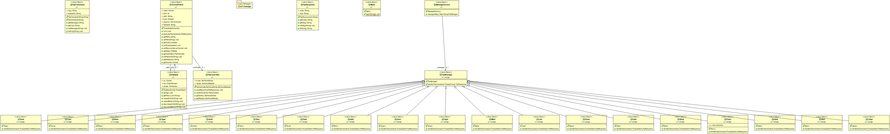

# Projet 2

- Assima Arthur
- Nordine El ammari

## Description 

L'objectif du projet est désormais de mettre en œuvre un serveur conforme au protocole applicatif File Transfer Protocol (FTP). Ce serveur doit donc utiliser l'API Socket TCP pour échanger avec un client FTP (e.g., Filezilla) pour stocker et envoyer des fichiers en respectant le standard FTP.

## Commandes gérées:

- AUTH
- LIST
- PASV
- USER
- PASS
- SYST
- FEAT
- PWD
- TYPE 
- CWD
- CDUP
- QUIT
- RETR
- MKD
- RNFR
- RNTO

# Utilisation 

```code
mvn package
```

puis

```code
java -jar target/serverFTP-ftp.jar
```

- géneration de la javadoc :

```code
mvn javadoc:javadoc
```

## Architecture

diagramme uml:




## Code Samples

- Execution d'une commande grâce au design pattern factory


(ThreadClient.java)
```code
public FtpResponse execute(FtpCommand cmd) throws NullPointerException {
		FtpManage m = new ManageFactory().managesMap().get(cmd.getMessage()); // We use the FtpManage corresponding to
																				// the command
		try {
			return m.handle(cmd,this);			
		} catch (IOException e) {
			return new FtpResponse(500, "Error, your command is unrecognized/not implemented yet.");
		} catch (NullPointerException e) {
			return new FtpResponse(500, "Error, your command is unrecognized/not implemented yet.");
		}
	}
```

- Classe permettant d'échanger avec le client au travers d'un flux de données

```code
package sr1;

import java.io.BufferedReader;
import java.io.BufferedWriter;
import java.io.IOException;


public class FtpController {
	private BufferedWriter writer;
	private BufferedReader reader;

	public FtpController(BufferedWriter writer, BufferedReader reader) {
		super();
		this.writer = writer;
		this.reader = reader;
	}

	/**
	 * Sends an FTP response to the client through the controller.
	 * 
	 * @param the FTP response to send
	 * @throws IOException when a network error on write through socket
	 */
	public void sendResponse(FtpResponse response) throws IOException {
		System.out.println("> " + response.getCode() + " " + response.getMsg());
		this.writer.write(response.toString());
		this.writer.flush();
	}

	/**
	 * Reads a command of the FTP client through the control socket connection.
	 * 
	 * @return an instance of the FTP command based on the message sent by the FTP
	 *         client.
	 * @throws IOException if a network error on read through socket
	 */
	public FtpCommand readCommand() throws IOException {
		String line = this.reader.readLine();
		if (line == null) {
			return null;
		}

		String[] mots = line.split(" ");
		if (mots.length > 1) { //Command with an argument (ex : CWD)
			String param = mots[1];
			for (int i = 2; i < mots.length; i++) {
				param += " " + mots[i];
			}

			System.out.println("Command received : " + mots[0] + " " + param);
			return new FtpCommand(mots[0], param);
		} else {
			System.out.println("Command received : " + mots[0]);
			return new FtpCommand(mots[0]);
		}
	}

	public BufferedWriter getWriter() {
		return writer;
	}

	public BufferedReader getReader() {
		return reader;
	}
}
```
